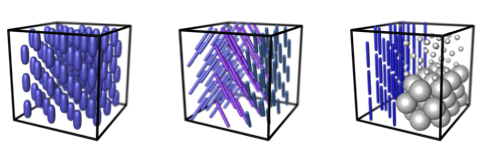

#MD-dMRI methods

Three families of methods are currently implemented within the framework of MD-dMRI:
* Diffusion tensor distributions
* Diffusional exchange
* Diffusion and incoherent flow

The methods are described briefly below, in some more detail in two review articles,1,2 and more exhaustively in the original publications cited for each method. Before a mathematically and physically correct description of the methods and the parameters that can be obtained, we start with a more hand-waving line of reasoning intended for a non-expert reader that has previous experience of conventional dMRI. The following text assumes familiarity with standard dMRI terminology such as diffusion tensors, diffusion anisotropy, kurtosis, orientation distributions functions, and intravoxel incoherent motion, as well as the commonly used acronyms DTI, MD, FA, and DKI.3-6

##Diffusion tensor distributions
The microscopic geometry of tissue is imprinted in the sizes, shapes, and orientations of the water diffusion tensors that are measured with dMRI. Conventional methods give diffusion tensors that are averaged over all the microscopic water environments within the millimeter-size imaging voxels, thereby giving ambiguous information for heterogeneous tissue which is ubiquitous in the human brain. Our MD-dMRI methods have the capability to disentangle the effects of microscopic diffusion tensor sizes, shapes, and orientations, allowing for detailed tissue characterization in terms of well-defined statistical measures of the diffusion tensor distributions. These measures have simple and intuitive relations to tissue properties such as average cell shape and variability of cell density.

The diffusion tensor distribution (DTD) model relies on the assumption that the water molecules within a voxel can be grouped into sub-ensembles exhibiting anisotropic Gaussian diffusion as quantified by a microscopic diffusion tensor **D**, which can be reported as a 3x3 matrix and visualized as an ellipsoid or a superquadric with semi-axis lengths and directions given by the tensor eigenvalues and eigenvectors. Somewhat colloquially, a diffusion tensor is characterized by its size, shape, and orientation, which are properties that are given by the chemical composition and micrometer-scale geometry of the pore space in which the water is located.

The figure above is a schematic illustration of a heterogeneous voxel as a collection of microscopic diffusion tensors, each representing a sub-ensemble of water molecules. While conventional DTI and DKI yield parameters where the information about the sizes, shapes, and orientations of the members of the collections are inextricably entangled, the DTD models are designed to give “clean” size, shape, and orientation measures that are intuitively related to conclusions that can be drawn by simply looking at a picture with a schematic ensembles. For the voxel above, we can observe four types of microscopic tensors: two spherical ones having different sizes as well as two nearly linear ones with identical sizes and shapes, but different orientations. Within the approximation of the DTD model, the most complete description of the voxel would be a list of sizes, shapes, orientations, and fractional populations of the microscopic tensors, or, alternatively, a continuous probability distribution _P_(**D**). Such a complete description is challenging to obtain, but actually possible with sufficient access to scanner time. Less challenging is to give up the attempts at finding separate components in the distribution and instead focus on scalar measures quantifying means and variances of the size, shape, and orientation properties. The utility of such an approach is illustrated with the three examples below that are indistinguishable with conventional DTI – the voxel-average diffusion tensor and the derived parameters MD and FA would be exactly the same.

The ensemble to the left comprises identical prolate tensors with the same orientations, and the middle example contains nearly linear tensors with three different orientations. While the tensors of the left and middle examples have the same sizes, they differ with respect to shapes and orientations. The example to the right is more complex with three distinct tensors: small and large spheres as well as linear tensors with intermediate size. In order to distinguish the three cases, we need at least three scalar measures, for instance the variance of sizes, the average shape, and the orientational order parameter. All examples have the same average sizes, and, although not immediately obvious, the left and right examples have identical average shapes and order parameters. The left and middle cases can be distinguished from both their different average shapes and order parameters, while the unique property of the example to the right is its variance of both sizes and shapes.

###Parameterization of the diffusion tensor
In the text above, we have described the diffusion tensors with the terms size, shape, and orientation without including proper definitions. A general diffusion tensor **D** contains six independent elements and can be parameterized according to several different conventions.2 Imposing the constraint that the microscopic tensors are axisymmetric, the number of independent elements is reduced to four. Rather than reporting explicit tensor elements, it is more intuitive to parameterize the tensor in terms of the isotropic average _D_iso, the normalized anisotropy _D_Delta, as well as the polar and azimuthal angles phi and theta specifying the orientation of the main symmetry axis in the lab frame.7 The parameters _D_iso and _D_Delta are quantitative measures of, respectively, the sizes and shapes of the tensors in the figures above. The values of _D_Delta cover the range from –1/2 for planes, to 0 for spheres, and +1 for sticks.

###Four-, two-, and one-dimensional projections of the DTD
The general six-dimensional DTD _P_(**D**) can for the axisymmetric case be written as the four-dimensional distribution _P_(_D_iso,_D_Delta,theta,phi) with clear separation of the size, shape, and orientation properties in individual dimensions. Integrating _P_(_D_iso,_D_Delta,theta,phi) over the orientation dimensions gives the two-dimensional size-shape distribution _P_(_D_iso,_D_Delta), which upon integration over the shape dimension leaves the one-dimensional size distribution _P_(_D_iso).

###Scalar parameters describing the DTD
For distinguishing the three distributions in the figure above, it is sufficient to determine scalar measures quantifying the variance of sizes and the average shapes. Some examples of parameters that can be used for this purpose are the variance of isotropic diffusivities V(_D_iso) and the mean-square anisotropy <(_D_iso_D_Delta)2>. In the method descriptions below, the information contained in these size and shape parameters are reported with different names, symbols, and types of normalization.

###DTD Methods
The MD-dMRI methods for quantifying DTDs can be classified according to number of investigated dimensions (1D size, 2D size-shape, 4D size-shape-orientation) and the resolution in each dimension (mean, mean and variance, assumed distribution shape, constrained distribution with a few discrete components, unconstrained distribution). Using these criteria, methods from the literature can be put in the following scheme:

|  | 1D size| 2D size-shape | 4D size-shape-orientation|
| ---:|:---:|:---:|:---:|
| mean | MD | Pake | Saupe |
| mean and variance |  |  | QTI |
| assumed shape |  | gamma |   |
| constrained |   | codivide, ndi |    |
| unconstrained |  | PRL |  ISMRM |

|  | size| shape | orientation|
| ---:|:---:|:---:|:---:|
| MD | mean | - | - |
| Pake | mean | mean | - |
| Saupe | mean | mean | order tensor |
| gamma |  mean and variance | mean | order parameter |
| cov |  mean and variance | mean and variance | order parameter |
| codivide | 3comp dist | 3comp dist | - |
| PRL | dist | dist | - |
| ISMRM | dist | dist | dist |

gamma = DIVIDE
####size-shape-orientation 
* dtd_full, integral transform, NNLS shotgun
* dtd_axsym, integral transform, NNLS shotgun 1
* dtd_cum2, 2-term cumulant <**D**> **C**, LLSQ 8
* dtd_dti, 1-term cumulant <**D**>, LLSQ 4

####size-shape
* dtd_pa_full, integral transform, NNLS shotgun 9
* dtd_pa_cum2, 2-term cumulant <_D_iso>, V(_D_iso), NLSQ
* dtd_pa_gamma, gamma, NLSQ 10
* dtd_pa_codivide, constrained 3 comp, NLSQ
* dtd_pa_ndi, constrained 3 comp, NLSQ
* dtd_pa_pake, 1 comp, NLSQ 7

####size
* dtd_iso_full, integral transform, NNLSshotgun
* dtd_iso_gamma, gamma, NLSQ
* dtd_iso_exp, exp, NLSQ

##Diffusional exchange
The plasma membrane separates the intracellular space from the surroundings and is an efficient barrier for water. The permeability of the membrane is affected by its chemical composition and the presence of channel proteins such as aquaporins. We have developed a MD-dMRI method to quantify the rate of molecular exchange between microscopic tissue environments with different local water diffusivity.11 The exchange rate is influenced by the barrier properties of the membrane and can for simple cellular systems be converted to a quantitative measure of the membrane permeability.12
*fexi11

##Diffusion and incoherent flow
Water in tissue and flowing in the capillary network have distinctly different patterns of translational motion. Our MD-dMRI method relies on motion encoding with variable sensitivity to flow and diffusion to quantify the density of blood capillaries.13
*vasco16

#References
1. D. Topgaard. Multidimensional diffusion MRI. J. Magn. Reson.,  (2017).
2. D. Topgaard. NMR methods for studying microscopic diffusion anisotropy. In: R. Valiullin (Ed.) Diffusion NMR in confined systems: Fluid transport in porous solids and heterogeneous materials, New Developments in NMR 9, Royal Society of Chemistry, Cambridge, UK (2017).
3. D. Le Bihan, E. Breton, D. Lallemand, P. Grenier, E. Cabanis, M. Laval-Jeantet. MR imaging of intravoxel incoherent motions - application to diffusion and perfusion in neurological disorders. Radiology 161, 401-407 (1986).
4. P.J. Basser, J. Mattiello, D. Le Bihan. Estimation of the effective self-diffusion tensor from the NMR spin echo. J. Magn. Reson. B 193, 247-254 (1994).
5. P.J. Basser, C. Pierpaoli. Microstructural and physiological features of tissues elucidated by quantitative-diffusion-tensor MRI. J. Magn. Reson. B 111, 209-219 (1996).
6. J.H. Jensen, J.A. Helpern, A. Ramani, H. Lu, K. Kaczynski. Diffusional kurtosis imaging: The quantification of non-Gaussian water diffusion by means of magnetic resonance imaging. Magn. Reson. Med. 53, 1432-1440 (2005).
7. S. Eriksson, S. Lasič, M. Nilsson, C.-F. Westin, D. Topgaard. NMR diffusion encoding with axial symmetry and variable anisotropy: Distinguishing between prolate and oblate microscopic diffusion tensors with unknown orientation distribution. J. Chem. Phys. 142, 104201 (2015).
8. C.-F. Westin, H. Knutsson, O. Pasternak, F. Szczepankiewicz, E. Özarslan, D. van Westen, C. Mattisson, M. Bogren, L. O'Donnell, M. Kubicki, D. Topgaard, M. Nilsson. Q-space trajectory imaging for multidimensional diffusion MRI of the human brain. Neuroimage 135, 345-362 (2016).
9. J.P. de Almeida Martins, D. Topgaard. Two-dimensional correlation of isotropic and directional diffusion using NMR. Phys. Rev. Lett. 116, 087601 (2016).
10. S. Lasič, F. Szczepankiewicz, S. Eriksson, M. Nilsson, D. Topgaard. Microanisotropy imaging: quantification of microscopic diffusion anisotropy and orientational order parameter by diffusion MRI with magic-angle spinning of the q-vector. Front. Physics 2, 11 (2014).
11. S. Lasič, M. Nilsson, J. Lätt, F. Ståhlberg, D. Topgaard. Apparent exchange rate (AXR) mapping with diffusion MRI. Magn. Reson. Med. 66, 356-365 (2011).
12. I. Åslund, A. Nowacka, M. Nilsson, D. Topgaard. Filter-exchange PGSE NMR determination of cell membrane permeability. J. Magn. Reson. 200, 291-295 (2009).
13. A. Ahlgren, L. Knutsson, R. Wirestam, M. Nilsson, F. Ståhlberg, D. Topgaard, S. Lasič. Quantification of microcirculatory parameters by joint analysis of flow-compensated and non-flow-compensated intravoxel incoherent motion (IVIM) data. NMR Biomed. 29, 640-649 (2016).

